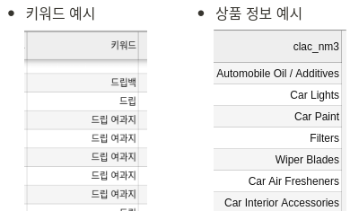
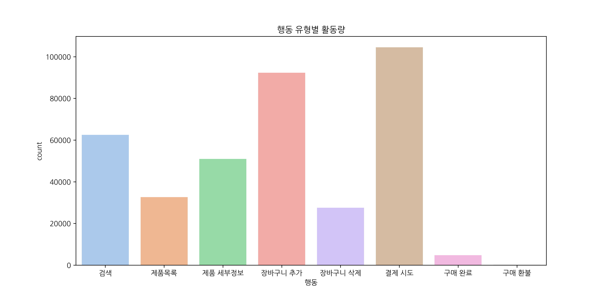
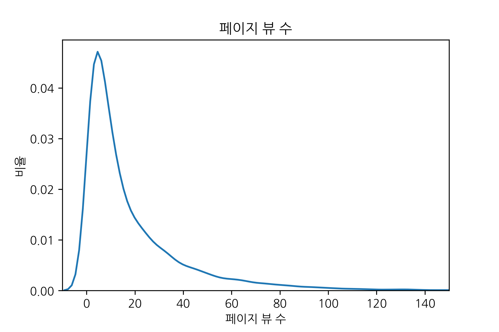
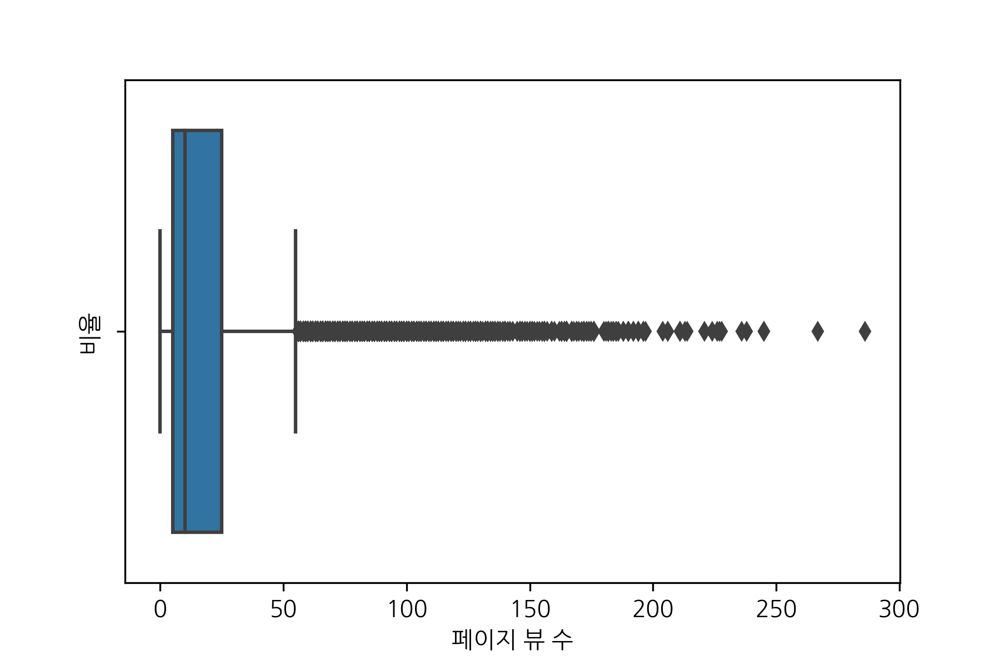
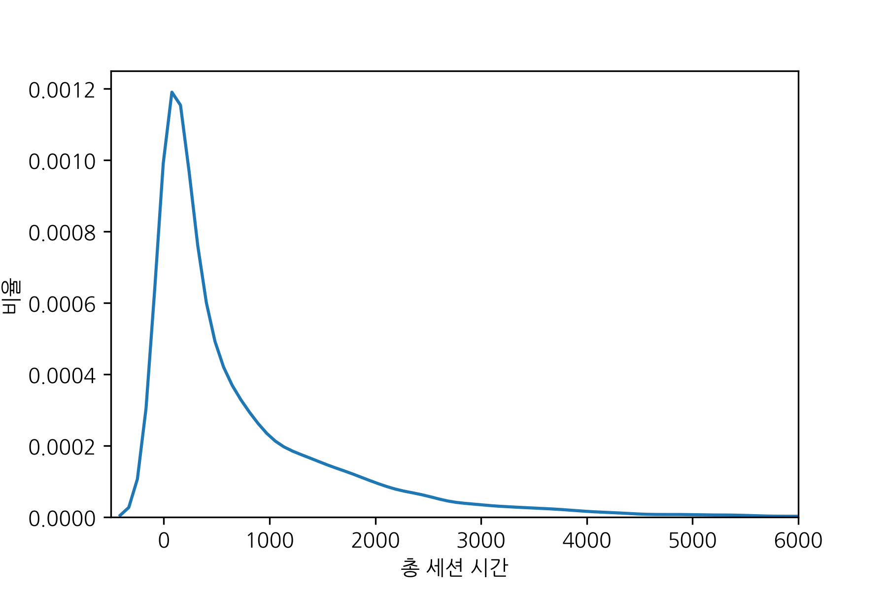
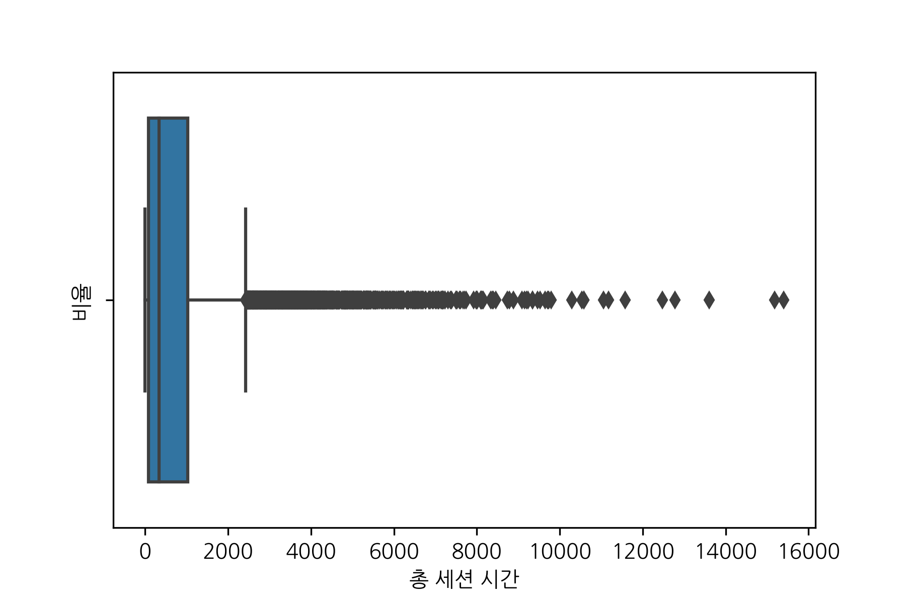
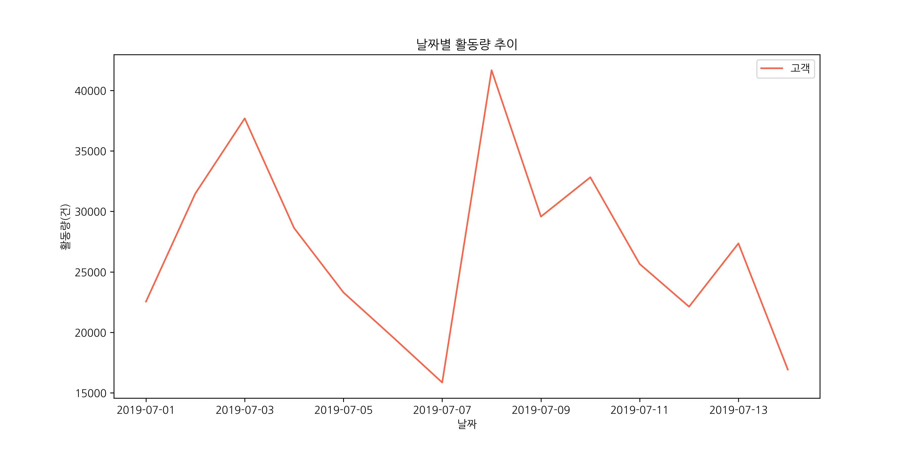
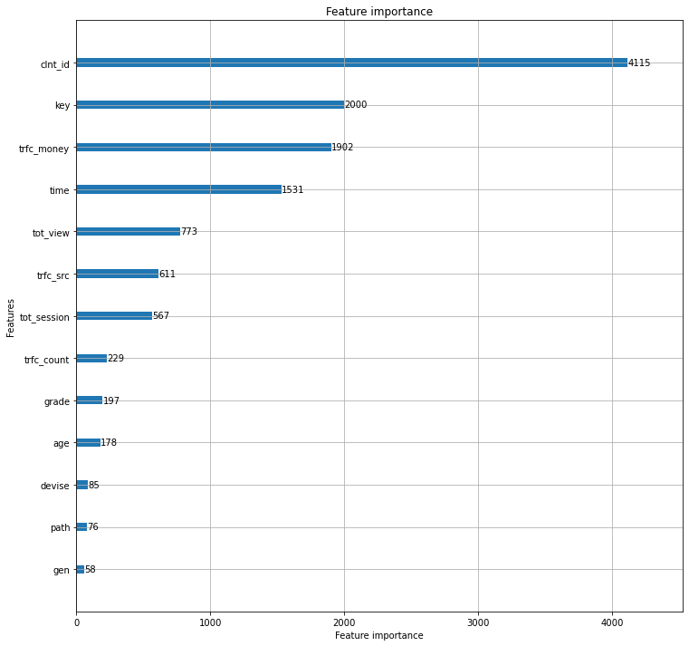

# 베이스라인 코드
---
## 0. 파파고 크롤링

<br>
검색 키워드는 한글로 되어 있는 반면 상품 정보는 영어로 되어있기 때문에 상관관계를 파악하기 어렵습니다.
그래서 파파고 크롤링을 통해서 소분류 상품 정보만 영 -> 한으로 바꾸는 작업을 하겠습니다.
한번에 하면 시간이 많이 걸리기 때문에 여러차례 나눠서 실행했습니다.
<br>
- 크롤링 코드
```python
product = pd.read_csv('data/03.Product classification.csv', encoding = 'utf-8')

chrome_options = webdriver.ChromeOptions()
chrome_options.add_argument('--headless') #내부 창을 띄울 수 없으므로 설정
chrome_options.add_argument('--no-sandbox')
chrome_options.add_argument('--disable-dev-shm-usage')

real_cate = product.clac_nm3[1300:1667]
real_cate = real_cate.fillna(0)

##### Crawling(Naver PaPago)
browser=webdriver.Chrome('/home/aiffel0042/Downloads/chromedriver', chrome_options=chrome_options )

url = 'https://papago.naver.com/?sk=en&tk=ko&hn=0'

browser.get(url)

new_keyword = []
for i in tqdm.notebook.tqdm(real_cate):
    search = browser.find_element_by_css_selector('textarea') # Input box selection
    search.send_keys(i)
    time.sleep(3)
    find = browser.find_element_by_css_selector('div#txtTarget') # Get text in outputbox
    new_keyword.append(find.text)
    time.sleep(3)
    browser.find_element_by_css_selector('#sourceEditArea > button').click() # Clear input box
    time.sleep(2)
```
크롤링 결과 상품의 소분류 정보가 모두 한글로 변경되었습니다.
<br>

## 1. 데이터 핸들링 
원할한 분석을 위해서 데이터를 변형해줄 필요가 있다고 생각했습니다.  
아래와 같은  몇가지 조건으로 데이터를 처리습니다.

- 칼럼 이름을 한글로 변경
- 이주일치만 남기기 - 빠른 분석을 위함
- A03에서 구매한 사람의 데이터만 구성
- 한번도 구매 안한사람 제외
- 아이템을 영어에서 한글로 바꿈
- 간단한 전처리

#### 칼럼 이름을 한글로 변경

데이터의 칼럼 명이 영어로 되어 있어서 직관적인 이해를 방해한다고 생각했습니다.
그래서 간단하게 칼럼을 한글로 바꿨습니다.

```py
online.columns = ['고객', '세션', '조회번호', '행동', '상점', '날짜','조회시각', '경과시간', '거래정보', '키워드', '총뷰', '총세션', '경로', '장비', '등급']
trade.columns = ['고객', '거래정보', '거래번호', '상점', '상품', '구매일자','구매시간', '구매금액', '구매수량']
customer.columns = ['고객', '성별', '나이']
item.columns = ['상품', '대분류', '중분류', '소분류']
```

#### 이주일치만 남기기

분석을 하다보면 많은 데이터의 양이 불필요한 시간낭비를 초래합니다.
그래서 3개월이 아닌 2주만 남기고 데이터를 정리했습니다.
```py
online_week = online[online['날짜'] < 20190715]
online_week = online_week.sort_values(by='날짜')
online_week.shape
```
#### A03을 제외한 row 제거

온라인 데이터에서는 총 3군데 (A01, A02, A03)의 상점 정보가 있습니다.
이 중에서 A03만 남기고 제외하겠습니다.

```py
online_week = online_week[online_week['상점'] == 'A03']
```
#### 상품정보를 영어에서 한글로 바꿈
키워드는 한글로 되어있는 반면, 상품 정보는 영어로 되어 있습니다.
추후에 키워드와 상품 정보의 상관 관계를 파악하기 위해서 한글로 변경하겠습니다.

```py
papago = pd.read_csv('csv/papago.csv', header=None)
item['소분류'] = papago[0]
item.head()
```
#### 데이터 합치기
간단한 분석을 위해서 필요한 칼럼만 추출하고 merge하겠습니다.
이때 4개의 데이터를 합쳐서 한개의 데이터로 만들어줍니다.

```py
temp = pd.merge(online_week[online_col], trade_int[trade_col], on='거래정보')
temp = pd.merge(temp, customer[customer_col], on='고객')
df_data = pd.merge(temp, item[item_col], on='상품')

df_data= df_data.drop(['세션', '거래정보', '상점', '상품' , '조회번호', '구매시간'], axis = 1)
df_data.head()
```

## 2. 데이터 분석
앞서 해당 데이터가 꽤 크므로 간단한 분석용으로 줄였습니다.
이번에는 간단한 데이터 소개를 하고 EDA를 진행하겠습니다.

#### 데이터 소개
총 4개의 파일이 있습니다.

- online = 고객의 온라인 행동 정보 데이터입니다.
- trade = 거래 정보 데이터 입니다. online과 고객ID, 거래ID로 이어져 있고, item과 상품코드로 이어져 있습니다.
- customer = 고객 정보를 답고 있는 데이터입니다.
- item = 상품 분류 코드를 담고 있는 데이터입니다.

### EDA
#### 행동 유형 시각화


그래프를 보면 결제를 시도할 확률이 높지만, 구매완료로 이어지는 것은 생각보다 적습니다.
결제 절차가 너무 복잡한 건 아닌지 의문이 듭니다.
아니면 결제 시도를 할 때 확정하는 부분은 좀 더 고민을 하는지 생각해볼 수 있습니다.

#### 페이지 뷰 수 시각화

페이지 뷰는 15-20 부근에서 가장 많으며 점점 전체 뷰 수가 떨어지고 있습니다.  
페이지 뷰 수에 따른 구매율도 확인할 필요가 있습니다.

페이지 뷰 수가 과도하게 많은 데이터가 존재합니다.
이 부분도 어떻게 처리할 지 고민해봐야 겠습니다.
#### 총 세션 시간 시각화




위의 페이지 뷰 수와 비슷한 양상을 보이고 있습니다.

#### 날짜별 활동량 추이


2018년 7월 1일은 월요일 입니다.
주말에 활동량이 약간씩 떨어지는 추이를 보이고 있습니다.
2주치 데이터 밖에 없어서 결론을 내릴 수는 없지만 공휴일에는 택배가 운영을 안하거나,
다들 야외활동을 많이 하기 때문에 상대적으로 온라인 활동이 줄어 들 수도 있을 것 같습니다.


## 3. 모델링 및 학습

### 간단한 전처리
간단한 추천 시스템을 구현하기 위해 lightgbm으로 모델을 돌려봤습니다.  
모델을 돌리기 전에 간단한 전처리를 했습니다.
- 카테고리 데이터의 경우: LabelEncoder후에 StandardScaler로 정규화
- 연속적인 데이터의 경우: StandardScaler로 정규화

### 모델 학습
- lightgbm으로 학습합니다.
- feature의 중요도를 시각화 합니다.
- 정확도를 평가합니다.

```py
lgb_model = lgb.train(params=params,
                      train_set=dtrain,
                      early_stopping_rounds=50, # typical
                      num_boost_round=1000,
                      valid_sets=[dvalid],
                      verbose_eval=False
                     )

```
#### feature 중요


lgbm을 돌리면 피쳐의 중요도를 알 수 있습니다.  
위의 사진에서는 고객 정보, 검색 키워드, 구매 금액, 시간 등이 중요한 피쳐로 판단됩니다.

### 모델 정확도 평가
```py
def is_correct(df):
    target_list = df['소분류'].unique()
    for i in df.index:
        if df['pred'].loc[i] in target_list:
            df.loc[i, 'is_correct'] = 1
    return df

```

```py
pred = lgb_model.predict(test_x)
df_pred = pd.DataFrame(pred).apply(lambda x: x.idxmax(), axis=1)
id_for_test_x.reset_index(drop = True, inplace = True)
id_for_test_x['pred'] = df_pred
id_for_test_x.sort_values(by = ['고객'], inplace = True)
id_for_test_x.reset_index(drop = True, inplace = True)

# is_correct가 0인 경우 오답, is_correct가 1인 경우 정답
id_for_test_x['is_correct'] = 0
output = id_for_test_x.groupby(['고객']).apply(lambda x: is_correct(x))
output[['고객', '소분류', 'pred','is_correct']]
```
정확도 측정 결과 4.7%로 나왔습니다.  아직은 개선해야 될 부분이 많아보입니다.
